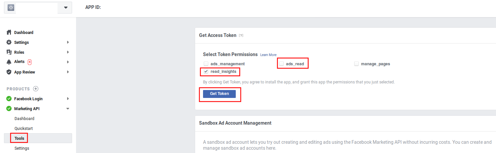

# marketing-data-connectors
## Talend jobs to extract and load marketing data using Facebook Marketing API, Google Analytics, Google Sheets, etc

### Setup overview

1. Clone or download & extract this repository
https://github.com/jrosell/marketing-data-connectors.git

2. Decide what connectors you will use and comment/uncomment run.sh what you need or not.

- Facebook CSV: copy fb-sample.csv to fb.csv
- Facebook CSV to Gsheets too: Copy fb-sheets-sample.csv to fb-sheets.csv
- Google Analytics CSV: Copy fb-sample.csv to fb.csv
- Google Analytics CSV to Gsheets too: Copy ga-sheets-sample.csv to ga-sheets.csv

3. See detailed connectors setup section.

4. Give execution permisions and execute:
- On Linux or Mac, use run.sh file from terminal
```
$ chmod u+x ./run.sh

$ ./run.sh
```
- On Windows, check run.bat properties and run from comand line
```
> run.bat
```

5. You may want to schedule it daily using cronjob. For example, at 8am every day on Linux:
```
$ crontab -e

0 8 * * * /your-absolute-path/run.sh
```

### Detailed connectors setup

#### Facebook CSV
1. Create an app or add Marketing API product to an existing one: https://developers.facebook.com/apps/

2. You need to generate a access_token and you need to know your ad_account_id. 

- The ad_account_id format is like this one act_#####. You can see it "act=" as a parameter on you business manager account and it will be written as "act_"


- The access_token is a very long string that you get when you give read_insights permissions to your app.



3. Open fb.csv and change at last facebook_ads_ad_account_id & facebook_ads_access_token with your ad_account_id & access_token
- In days, set the numbers of days you want to go back from yesterday.
- In facebook_ads_version, set the Marketing API version you want to use.

4. Check execution results on output/facebook_ads.csv. You can open it using [Libreoffice](https://www.libreoffice.org/) or any spreadsheet software.


#### Facebook CSV to Gsheets

0. See "Facebook CSV" connector setup first.

1. If you don't currently have a service account and download its p12 file, create a service account and download its p12 file.
- Open the Service Accounts page in the GCP Console https://console.cloud.google.com/iam-admin/serviceaccounts
- Click Select a project, select your project and click Open.
- Click Create Service Account and enter a service account name (friendly display name), an optional description, select a role you wish to grant to the service account, and then click Save.
- Create a key and select P12. Download your p12 file.
- Write down your google_service_account_email and google_key_file_p12

2. Enable APIs Google Sheets API on https://console.cloud.google.com/apis/library/sheets.googleapis.com

3. Open or create a new Google Spreadsheet and write down its file id.
- You can see google_sheet_file_id on URL https://docs.google.com/spreadsheets/d/google_sheet_file_id/edit
- Add google_service_account_email user with edit permissions.

4. Change fb-gsheets.csv with your google_service_account_email, google_key_file_p12, google_sheet_file_id.
- Upon succesful execution, CSV input should be seen on google_sheet_name sheet of the google_sheet_file_id spreadsheet 

### Google Analytics CSV

1. If you don't currently have a service account and download its p12 file, create a service account and download its p12 file.
- Open the Service Accounts page in the GCP Console https://console.cloud.google.com/iam-admin/serviceaccounts
- Click Select a project, select your project and click Open.
- Click Create Service Account and enter a service account name (friendly display name), an optional description, select a role you wish to grant to the service account, and then click Save.
- Create a key and select P12. Download your p12 file.
- Write down your google_service_account_email and google_key_file_p12

2. Enable APIs Google Analytics Reporting API v3 on https://console.cloud.google.com/apis/library/analytics.googleapis.com

3. Add google_service_account_email as user with read permisions on you GA View. Write down viewId.

4. Change ga.csv with your google_service_account_email, google_key_file_p12 and google_ga_view
- Upon succesful execution, output/ga.csv will show aquisition data for last days with the indicated goal metric as last column too.

### Google Analytics CSV to Gsheets

0. See "Google Analytics CSV" connector setup first.

1. You should already have a service account and its p12 file. Enable APIs Google Sheets API on https://console.cloud.google.com/apis/library/sheets.googleapis.com

3. Open or create a new Google Spreadsheet and write down its file id.
- You can see google_sheet_file_id on URL https://docs.google.com/spreadsheets/d/google_sheet_file_id/edit
- Add google_service_account_email user with edit permissions.

4. Change ga-sheets.csv with your google_service_account_email, google_key_file_p12, google_sheet_file_id.
- Upon succesful execution, CSV input should be seen on google_sheet_name sheet of the google_sheet_file_id spreadsheet 


## Open for collaborations
- You can do [pull resquests](https://github.com/jrosell/marketing-data-connectors/pulls) or [open issues](https://github.com/jrosell/marketing-data-connectors/issues) if you want to help.
- Hire me at https://thediar.com/en/ if you need any enterprise support.