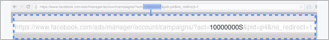
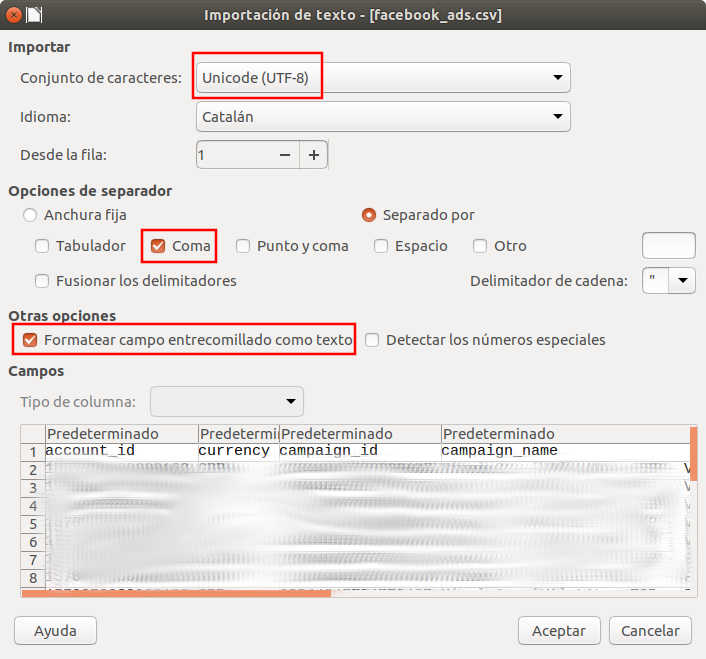

# marketing-data-connectors
## Command line batch jobs that run java to extract and load marketing data using Facebook Marketing API, Google Analytics API, Google Sheets API, etc

### Setup overview

1. Clone or download & extract this repository
https://github.com/jrosell/marketing-data-connectors.git

2. Decide what connectors you will use and comment/uncomment run.sh (Linux/Mac) or run.bat (Windows) what you need or not, and see detailed connectors setup section.

- FB_Campaigns: Copy fb-sample.csv to fb.csv and edit the copy as appropiate
- GA_Campaigns: Copy ga-sample.csv to ga.csv and edit the copy as appropiate
- Mailchimp_Campaigns: Copy mailchimp-sample.csv to mailchimp.csv and edit the copy as appropiate
- GSheets: Copy sheets-sample.csv to sheets.csv and edit the copy as appropiate
- Mysql: Copy mysql-sample.csv to mysql.csv and edit the copy as appropiate
- Postgresql: Copy postgresql-sample.csv to postgresql.csv and edit the copy as appropiate
- Clickhouse: Copy clickhouse-sample.csv to clickhouse.csv and edit the copy as appropiate

3. Give execution permisions and execute:
- On Linux or Mac, use run.sh file from terminal
```
$ cd your-absolute-file-path
$ chmod u+x ./run.sh
$ ./run.sh
```
- On Windows, check run.bat properties and run from command line (cmd.exe)
```
> cd your-absolute-file-path
> run.bat
```

4. You may want to schedule it daily using cronjob. For example, at 8am every day on Linux:
```
$ crontab -e

0 8 * * * /your-absolute-file-path/run.sh
```

### Detailed connectors setup

#### FB_Campaigns

1. On facebook, Create an app or add Marketing API product to an existing one: https://developers.facebook.com/apps/

2. You need to generate a access_token and you need to know your ad_account_id. 

- The ad_account_id format is like this one act_#####. You can see it "act=" as a parameter on you business manager account and it will be written as "act_"



- The access_token is a very long string that you get when you give read_insights and ads_read permissions to your app.


3. Open fb.csv and change at last facebook_ads_ad_account_id & facebook_ads_access_token with your ad_account_id & access_token
- In days, set the numbers of days you want to go back from yesterday.
- In facebook_ads_version, set the Marketing API version you want to use.

4. Check execution results on output/facebook_ads.csv. You can open it using [Libreoffice](https://www.libreoffice.org/) or any spreadsheet software.



 
### GA_Campaigns

1. If you don't currently have a service account and download its p12 file, create a service account and download its p12 file.
- Open the Service Accounts page in the GCP Console https://console.cloud.google.com/iam-admin/serviceaccounts
- Click Select a project, select your project and click Open.
- Click Create Service Account and enter a service account name (friendly display name), an optional description, select a role you wish to grant to the service account, and then click Save.
- Create a key and select P12. Download your p12 file.
- Write down your google_service_account_email and google_key_file_p12

2. Enable APIs Google Analytics Reporting API v3 on https://console.cloud.google.com/apis/library/analytics.googleapis.com

3. Add google_service_account_email as user with read permisions on you GA View. Write down viewId.

4. Change ga.csv with your google_service_account_email, google_key_file_p12 and google_ga_view
- Check google_ga_view on the admin section of your Google Analytics view.
- Upon succesful execution, output/ga.csv will show aquisition data for last days with the indicated goal metric as last column too.

### GW_SearchAnalytics


1. You should have a service account and its p12 file. Enable  Google Search Console API  on https://console.cloud.google.com/apis/library/webmasters.googleapis.com

2. Add google_service_account_email as user with Restricted or Full permisions on your Google Search Console Property. Write down siteUrl

4. Change gw.csv with your google_service_account_email, google_key_file_p12 and siteUrl
- Check siteUrl on the settings section of your Google Search Console property.
- Upon succesful execution, output/gw_query.csv, output/gw_page.csv, output/gw_query_page.csv and output/gw_query_page_country_dimension.csv will be generated with impressions, clicks, ctr, position metrics.


### Mailchimp_Campaigns

1. Login your Mailchimp account, go to Account / Extras / API keys and click Create A Key.
2. Edit mailchimp.csv:
- Name your account.
- Set your apikey.
- Last part of apikey contains your datacenter (example us3 or us10).
- Set your count (Numbre of campaigns you will get with this connector).
- Upon succesful execution, you will get campaign data at retrieve date on output/mailchimp_campaigns.csv file.

### Gsheets

0. See FB_Campaigns, GA_Campaigns, Mailchimp_Campaigns and GW_SearchAnalytics connector setup first.

1. You should have a service account and its p12 file. Enable APIs Google Sheets API on https://console.cloud.google.com/apis/library/sheets.googleapis.com

3. Open or create a new Google Spreadsheet and write down its file id.
- You can see google_sheet_file_id on URL https://docs.google.com/spreadsheets/d/google_sheet_file_id/edit
- Add google_service_account_email user with edit permissions.

4. Change gsheets.csv with your google_service_account_email, google_key_file_p12, google_sheet_file_id.
- Upon succesful execution, CSV input data should be seen (insert at first row) on google_sheet_name sheet of the google_sheet_file_id spreadsheet.
- Is important to set desired 'type' as used in other connectors: fb_campaigns, fb_campaigns_stats, fb_campaigns_actions, ga_campaigns, ga_campaigns_stats, ga_campaigns_goals and mailchimp_campaigns, gw_query, gw_page, gw_query_and_page, gw_query_page_country_and_device.


### Mysql

0. See FB_Campaigns, GA_Campaigns, Mailchimp_Campaigns and GW_SearchAnalytics connector setup first.

1. You should have mysql server database with its user and password.

2. Change mysql.csv with your mysql "host", "port", "database", "username" and "password"
- Upon succesful execution, CSV input data should be replaced (update and insert) on "table" of your "database"
- Is important to set desired 'type' as used in other connectors: fb_campaigns, fb_campaigns_stats, fb_campaigns_actions, ga_campaigns, ga_campaigns_stats, ga_campaigns_goals and mailchimp_campaigns, gw_query, gw_page, gw_query_and_page, gw_query_page_country_and_device.


### Postgresql

0. See FB_Campaigns, GA_Campaigns, Mailchimp_Campaigns and GW_SearchAnalytics connector setup first.

1. You should have Postgresql server database with its schema, user and password.

2. Change postgresql.csv with your Postgresql "host", "port", "database", "schema", "username" and "password"
- Upon succesful execution, CSV input data should be replaced (update and insert) on "table" of your "database" and "schema"
- Is important to set desired 'type' as used in other connectors: fb_campaigns, fb_campaigns_stats, fb_campaigns_actions, ga_campaigns, ga_campaigns_stats, ga_campaigns_goals and mailchimp_campaigns, gw_query, gw_page, gw_query_and_page, gw_query_page_country_and_device.


### Clickhouse

0. See FB_Campaigns, GA_Campaigns, Mailchimp_Campaigns and GW_SearchAnalytics connector setup first.

1. You should have Clickhouse server database with its user and password.

2. Change clickhouse.csv with your Clickhouse "host", "port", "database", "username" and "password"
- Upon succesful execution, CSV input data should be seen (truncate and insert) on "table" of your "database"
- Is important to set desired 'type' as used in other connectors: fb_campaigns, fb_campaigns_stats, fb_campaigns_actions, ga_campaigns, ga_campaigns_stats, ga_campaigns_goals and mailchimp_campaigns, gw_query, gw_page, gw_query_and_page, gw_query_page_country_and_device.


## About us
- I'm [Jordi Rosell](https://twitter.com/jrosell), working at The ducks in a row. 
- Disclaimer: Provided "AS IS". Hire me at https://www.thediar.com/en/ if you need enterprise support or a professional ETL service.
- Open for collaborations. Please, [open an issue](https://github.com/jrosell/marketing-data-connectors/issues) if you need help or if you want to suggest improvements or new features.